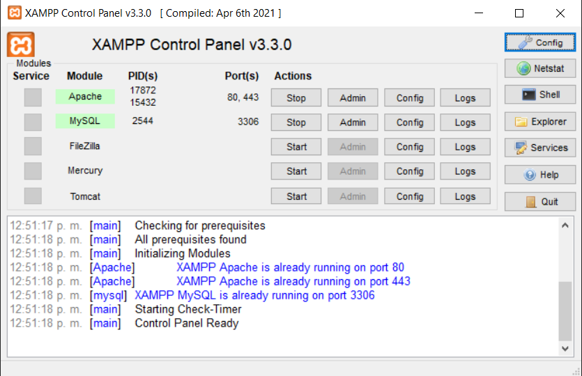
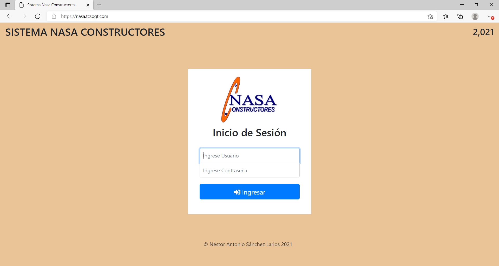

# REPOSITORIO SISTEMA DE CONTROL DE PROYECTOS, INGRESOS Y EGRESOS DE NASA CONSTRUCTORES

PROYECTO DE GRADUACIÓN DE NÉSTOR ANTONIO SÁNCHEZ LARIOS | 1890-17-2158

  

<h1>SISTEMA NASA CONSTRUCTORES EN LINEA</h1>
El sistema de NASA CONSTRUCTORES esta alojado en el siguiente subdominio:       

https://nasa.tcsogt.com/

<h4>CREDENCIALES DE ACCESO:</h4>

Usuario: nsanchez 

contraseña: Ns.291297

<h1>INSTALACION DE MANERA LOCAL CON XAMPP</h1>

 <b>PASO 1</b>
 
 Descargar un servidor local que cuente con <b>PHP</b> y <b>MySQL</b>. Recomendable <b>XAMPP</b> ya que es muy facil de instalar dejando el link de descarga a continuación:

https://www.apachefriends.org/download.html

<b>PASO 2</b>

Luego de instalar el servidor local nos dirigimos a la ubicación que por defecto es <b>C:\xampp\htdocs</b>, despues descargamos los archivos y los descomprimimos en este directorio.

<b>PASO 3</b>

Abrimos el panel de XAMPP y habilitamos <b>APACHE</b> y <b>MySQL</b>

<b>PASO 4</b>

Nos dirigimos hacia PhpMyadmin y del lado izquierdo encontraremos nueva base de dados y seleccionamos esa opción, cuando estemos en el apartado, colocamos el nombre de la base de datos, que tiene que decir "nasaconstructores". Seguido presionamos el botón crear y se creara la base de datos.

Luego seleccionamos la nueva base de datos y nos vamos al apartado de importar, presionamos el botón de seleccionar archivo, lo buscamos en la direccion anteriormente descrita, seleccionamos el archivo llamado nasaconstructores.sql lo cargamos y presionamos continuar y para proceder a creará las tablas de la base de datos en MySQL.

Una vez creada la base de datos en MySQL el sistema esta listo para ser usado.

<b>PASO 5</b>

Para ingresar al sistema de manera local, abrimos el navegador y colocamos la siguiente ruta en nuestro navegador:

http://localhost/nasaconstructores/
 
Seguido encontraremos una interfaz como esta:

  

<h4>CREDENCIALES DE ACCESO:</h4>

Usuario: nsanchez 

contraseña: Ns.291297

